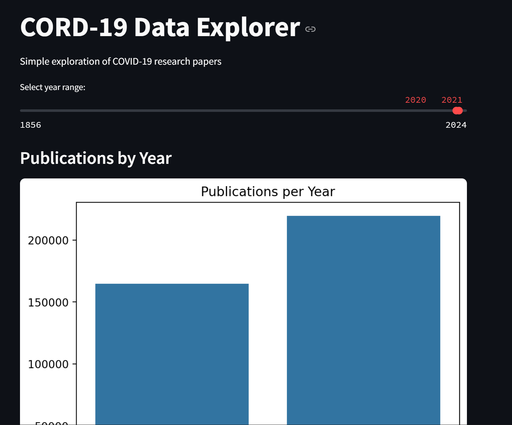

# Frameworks_Assignment

This project explores the **CORD-19 metadata dataset**, focusing on COVID-19 research publications.  
It demonstrates the **data science workflow** from loading and cleaning real-world data, to performing analysis, creating visualizations, and building an interactive **Streamlit web app**.

---

## 🎯 Objectives
By completing this project, you will:
- Practice loading and exploring a real-world dataset.
- Apply basic data cleaning and preparation techniques.
- Generate meaningful visualizations (publication trends, top journals, word frequencies).
- Build a Streamlit app to present data insights interactively.
- Document findings and reflect on the process.

---

## 📂 Repository Structure

Frameworks_Assignment/
│── data/
│ └── metadata.csv # Dataset (sampled from CORD-19 metadata)
│── notebooks/
│ └── analysis.ipynb # Jupyter notebook for exploration and analysis
│── app/
│ └── streamlit_app.py # Streamlit web application
│── requirements.txt # Project dependencies
│── README.md # Documentation


---

## ⚙️ Installation

Clone this repository and install dependencies:

```bash
git clone https://github.com/<your-username>/Frameworks_Assignment.git
cd Frameworks_Assignment
pip install -r requirements.txt


▶️ Usage
1. Explore Data in Jupyter Notebook

Open the analysis notebook to run step-by-step data exploration:

jupyter notebook notebooks/analysis.ipynb


2. Run the Streamlit App

Navigate to the app folder and launch the web application:

cd app
streamlit run streamlit_app.py


📊 Features

Publications by Year: Visualize how COVID-19 research evolved over time.

Top Journals: Identify the most active publishers.

Word Frequency: Explore common keywords in titles.

Interactive Filters: Select year ranges and view data dynamically.

Sample Data Table: Browse research papers with key details.



🧩 Requirements

Main libraries used:

pandas

matplotlib

seaborn

streamlit

wordcloud (optional, for text analysis)